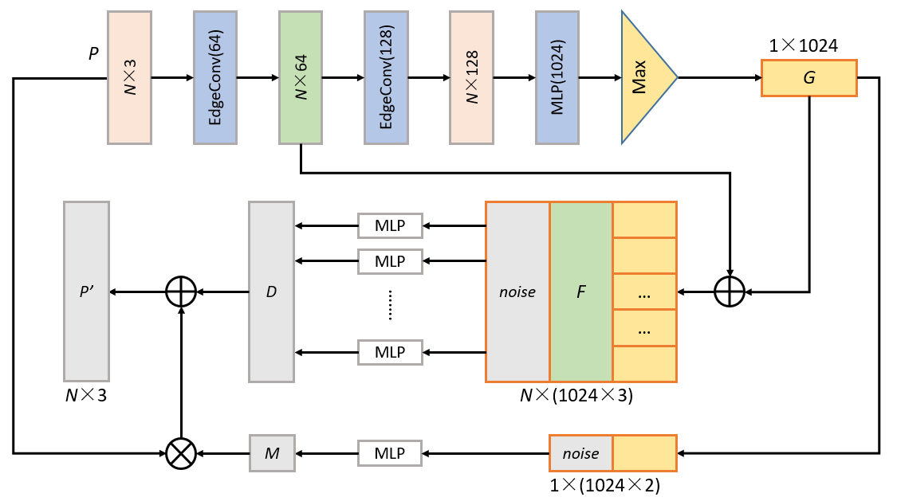
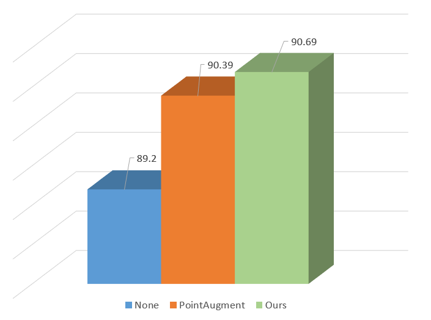

# PointGen
Work in progress.

The main idea comes from [this](https://openaccess.thecvf.com/content_CVPR_2020/papers/Li_PointAugment_An_Auto-Augmentation_Framework_for_Point_Cloud_Classification_CVPR_2020_paper.pdf)

We improved the feature extraction module in the original paper, which improved the classification accuracy of the classifier.



Modified the model according to my personal thoughts. The feature extraction part uses dgcnn.

The final result tested on the ModelNet40 dataset is about 0.3% higher than the paper, and about 1.5% higher than the original PointNet.



Please look forward to the completion of the paper.

### Dependencies

- Python 3.7
- CUDA 11
- PyTorch. At least 1.2.0
- (Optional) TensorboardX for visualization of the training process.

### Usage

Download the ModelNet40 dataset from [here.](https://shapenet.cs.stanford.edu/media/modelnet40_ply_hdf5_2048.zip)

To train a model to classify point clouds sampled from 3D shapes:

    python train_PA.py --data_dir ModelNet40_Folder

Log files and network parameters will be saved to ```log``` folder in default.


